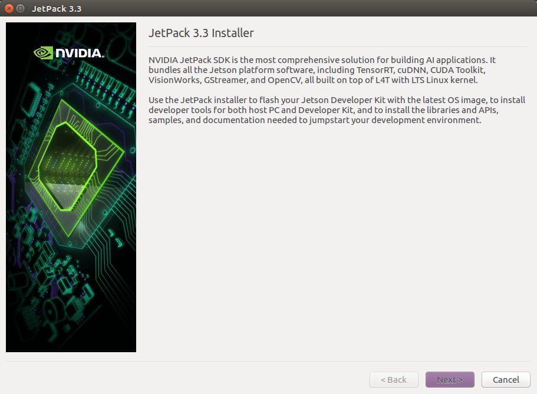
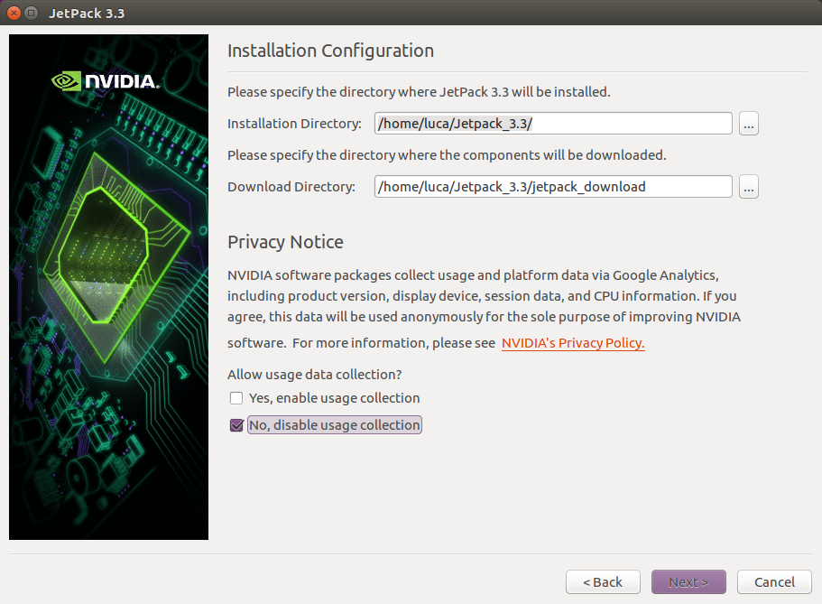
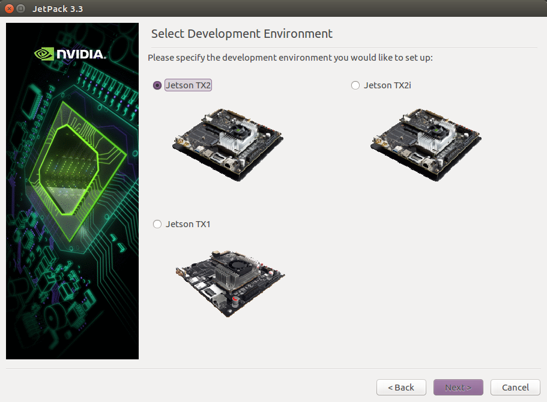
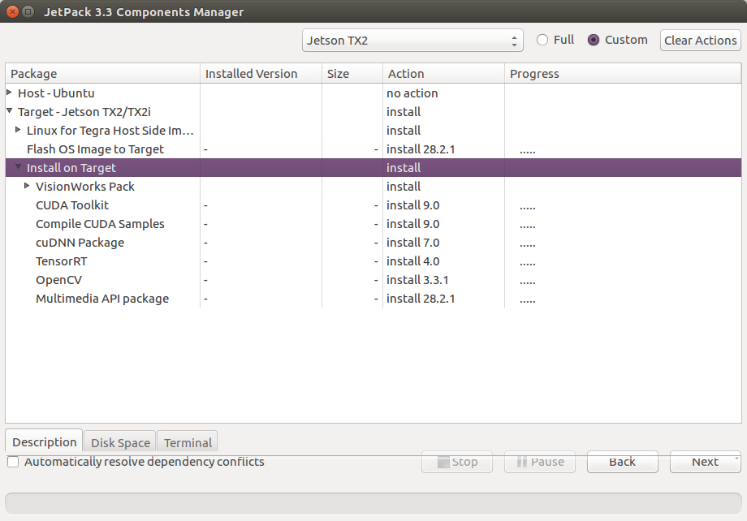
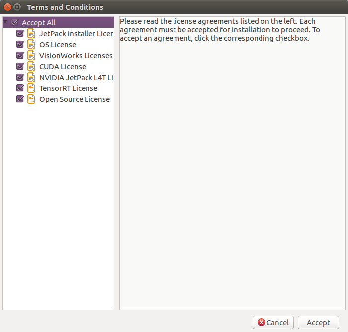
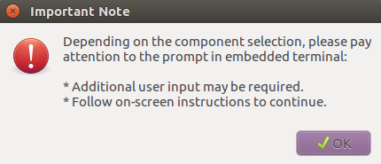
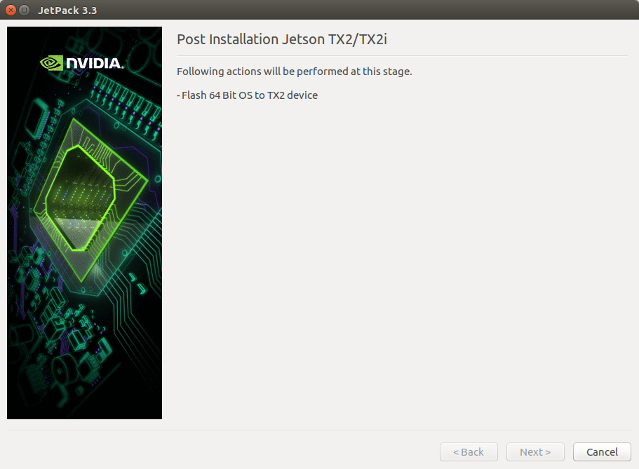
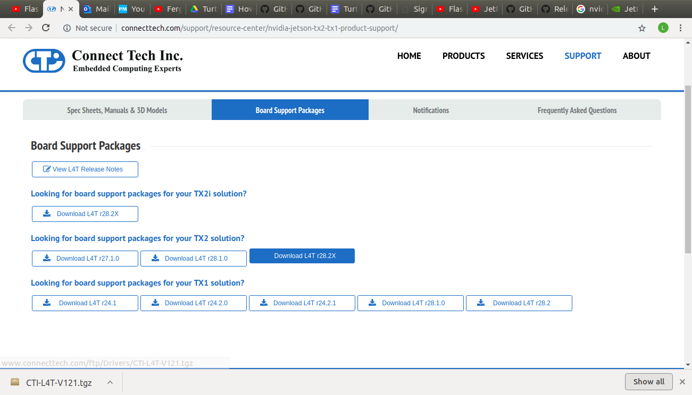

# Multi Turtlebot3 Exploration in 2D and 3D using NVIDIA Jetson TX2
This writeup includes instructions for integrating an NVIDIA Jetson TX2 and Intel RealSense R200 with a Turtlebot3 Burger. In addition, it includes the requirements for running multiple Turtlebot3 Burgers under a single ROS Master. Finally, it describes how to utilize this repository to perform collaborative multi-robot mapping in 2D and 3D. The Turtlebot3 hardware is all open source, as are the ROS packages used and modified to create this repository. Links to the original packages can be found at the [bottom of this writeup](#packages). This writeup assumes you have access to a computer running Ubuntu 16.04.

## Table of Contents
1. [Verify the Jetson](#jetson)
2. [Prepare JetPack](#jetpack)
3. [Flashing the Jetson](#orbitty)
4. [Setting up Git and ROS](#ros)
5. [Catkin Workspace](#catkin)
6. [Configuring the Kernel](#kernel)
7. [Integrating the RealSense](#r200)
8. [Integrating the OpenCR Board](#opencr)
9. [Setting up .bashrc](#bashrc)
10. [Running the System](#run)
11. [ROS Packages Used](#packages)

## <a name="jetson"></a>Verify NVIDIA Jetson TX2
1. Plug in and turn on the Jetson while connected to the original development board to start Ubuntu and verify functionality.

2. Remove the Jetson from the development board and secure it to the Orbitty Carrier Board. [This video](https://www.youtube.com/watch?v=9uMvXqhjxaQ) outlines exactly how to switch the boards and includes further details on flashing. For the rest of this setup, we continued to use the wifi antennae provided on the original development board while interfacing through the Orbitty Carrier Board. 

## <a name="jetpack"></a>Prepare JetPack files for flashing
The JetPack installer does not play nicely with the Orbitty Carrier Board. If using the Orbitty Carrier Board for a smaller embedded computer like we did, you must first run the JetPack installer to build all of the required files and then use the Connect Tech. installer to flash the Jetson TX2 with JetPack.

1. On a separate Ubuntu 16.04 computer, head to NVIDIA's [JetPack Archive](https://developer.nvidia.com/embedded/jetpack-archive) and download JetPack 3.3***. You will need an NVIDIA developer account to complete the download, but it is free to sign up using a .edu email address.

2. Make a new directory in the home folder titled "Jetpack_**X.Y**", where X and Y are the version and subversion of Jetpack you are using. We used Jetpack 3.3, so we titled the directory "Jetpack_3.3". Assuming the .run file (ours was called JetPack-L4T-3.3-linux-x64_b39.run) was downloaded to the Downloads folder, run the following commands to make the new directory, move the .run file, allow execution and run the setup,  renaming **"Jetpack_3.3"** with the correct version and subversion if necessary and replacing **"JetPack-L4T-3.3-linux-x64_b39.run"** with the name of your .run file:
```console
user@hostname: ~$ mkdir Jetpack_3.3 && cd Jetpack_3.3
user@hostname: ~/Jetpack_3.3$ mv ~/Downloads/JetPack-L4T-3.3-linux-x64_b39.run .
user@hostname: ~/Jetpack_3.3$ sudo chmod +x JetPack-L4T-3.3-linux-x64_b39.run
user@hostname: ~/Jetpack_3.3$ ./JetPack-L4T-3.3-linux-x64_b39.run
```

3. You will now be greeted by the JetPack installer. Follow the next steps carefully:

    1. Click Next on the first screen:
    <p align="center"></p>
  
    2. Do not change the installation or download directories. Check "No, disable usage collection" and click next:
    <p align="center">
  
    3. Select Jetson TX2 as the development environment:
    <p align="center"></p>
  
    4. Set the Action field to "no action" for Host-Ubuntu. Set the Action field to "mixed" for Target-Jetson TX2/TX2i and expand the package submenu. Set the Action field to "install" for Linux for Tegra Host Side Image Setup. Finally, set the Action field to "no action" for Install on Target. The components manager window should now look like the image below:
    <p align="center"></p>
  
    5. Ater reading the license agreements, select the accept all checkbox and click Accept. When prompted, input your user password:
    <p align="center"></p>
  
    6. Select okay and let all of the installations complete:
    <p align="center"></p>
  
    7. When prompted to flash the operating system to the TX2 select Cancel. We have now installed the required JetPack files onto our remote computer:
    <p align="center"></p>
  
## <a name="orbitty"></a>Flashing the Jetson TX2 on the Orbitty Carrier Board
1. On the Ubuntu 16.04 computer used in the above steps, head to the Connect Tech. [Board Support Package](http://connecttech.com/support/resource-center/nvidia-jetson-tx2-tx1-product-support/) webpage and download the appropriate L4T version for the board and JetPack. As we are using the Jetson TX2 with JetPack 3.3, we downloaded L4T version 28.2x (highlighted in blue below):
<p align="center"></p>

2. Assuming the .tgz file was downloaded to the Downloads folder, run the following commands to unzip and run the L4T installer, replacing **"CTI-L4T-V121.tgz"** with the name of the L4T .tgz file installed and replacing the Jetpack_X.Y directory with the correct name if necessary:
```console
user@hostname: ~$ cd Jetpack_3.3/64_TX2/Linux_for_Tegra
user@hostname: ~/Jetpack_3.3/64_TX2/Linux_for_Tegra$ mv ~/Downloads/CTI-L4T-V121.tgz .
user@hostname: ~/Jetpack_3.3/64_TX2/Linux_for_Tegra$ tar -xvf CTI-L4T-V121.tgz
user@hostname: ~/Jetpack_3.3/64_TX2/Linux_for_Tegra$ cd CTI-L4T
user@hostname: ~/Jetpack_3.3/64_TX2/Linux_for_Tegra$ sudo ./install.sh
```
3. After running the installation, put the Jetson into [Forced Recovery Mode](https://www.youtube.com/watch?v=9uMvXqhjxaQ) by pressing and holding POWER, then pressing and holding RESET (POWER should still be held down), then pressing and holding RECOVERY (POWER and RESET should still be held down), and then letting go of RECOVERY, followed by RESET, followed by POWER.

4. Using the Micro-USB to USB-A cable provided with the Jetson TX2, plug the Jetson into the computer used in the above steps. If you run `lsusb` in terminal you should see Nvidia Corp. If so, you are ready to flash the Jetson by running the following command on the computer:
```console
user@hostname: ~/Jetpack_3.3/64_TX2/Linux_for_Tegra$ sudo ./flash.sh orbitty
```

5. Once the script has finished, the Jetson is ready to use. Simply restart, plug in peripherals, and move on to the next steps.

## <a name="ros"></a>Install Git, ROS Kinetic, and ROS Package Dependencies
1. Install Git via the following commands on BOTH the Ubuntu 16.04 computer and NVIDIA Jetson TX2:
```console
sudo apt update
sudo apt install git
```
2. If the git installation has an issue, run the following and then retry step one above:
```console
 sudo apt-get purge runit
 sudo apt-get purge git-all
 sudo apt-get purge git
 sudo apt-get autoremove
 sudo apt update
 ```
3. Perform the following [ROS installation](http://wiki.ros.org/kinetic/Installation/Ubuntu) on BOTH the Ubuntu 16.04 computer and NVIDIA Jetson TX2:
```console
sudo sh -c 'echo "deb http://packages.ros.org/ros/ubuntu $(lsb_release -sc) main" > /etc/apt/sources.list.d/ros-latest.list'
sudo apt-key adv --keyserver hkp://ha.pool.sks-keyservers.net:80 --recv-key 421C365BD9FF1F717815A3895523BAEEB01FA116
sudo apt-get update
sudo apt-get install ros-kinetic-desktop-full
sudo rosdep init
rosdep update
echo "source /opt/ros/kinetic/setup.bash" >> ~/.bashrc
source ~/.bashrc
sudo apt install python-rosinstall python-rosinstall-generator python-wstool build-essential
```
4. Install the following ROS Dependencies on BOTH the Ubuntu 16.04 computer and NVIDIA Jetson TX2:
```console
sudo apt update
sudo apt-get install ros-kinetic-frontier-exploration ros-kinetic-navigation-stage
sudo apt-get install ros-kinetic-navigation
sudo apt-get install ros-kinetic-slam-gmapping
sudo apt-get install ros-kinetic-octomap ros-kinetic-octomap-mapping
sudo apt install ros-kinetic-multirobot-map-merge ros-kinetic-explore-lite
rosdep install octomap_mapping
sudo apt-key adv --keyserver keys.gnupg.net --recv-key C8B3A55A6F3EFCDE || sudo apt-key adv --keyserver hkp://keyserver.ubuntu.com:80 --recv-key C8B3A55A6F3EFCDE
sudo add-apt-repository "deb http://realsense-hw-public.s3.amazonaws.com/Debian/apt-repo xenial main" -u
sudo apt-get install librealsense2-dkms
sudo apt-get install librealsense2-utils
sudo apt-get install librealsense2-dev
sudo apt-get install librealsense2-dbg
```

## <a name="catkin"></a>Workspace for catkin
1. Create the catkin_ws via the following commands on BOTH the Ubuntu 16.04 computer and NVIDIA Jetson TX2:
```console
mkdir -p ~/catkin_ws/src
cd ~/catkin_ws/
catkin_make
source devel/setup.bash
```

## <a name="kernel"></a>Configuring the kernel and installing additional drivers.
1. On the Nvidia Jetson TX2, clone or download JetsonHacks' [buildJetsonTX2 repository](https://github.com/jetsonhacks/buildJetsonTX2Kernel) into the home directory. Enter the directory and run the following in terminal:
```console
nvidia@nvidia-tegra: ~/buildJetsonTx2Kernel-master$ sudo ./getKernelSources.sh
```

2. A kernel configuration window will open. Use the Find Tool (Ctl+F) to check off the following boxes. 3 & 4 below are only required if using a USB Wifi adapter as opposed to the antennae from the original developer board:
    1. CP210x port (For LiDAR)
    2. ACM port (For OpenCR Board)
    3. Networking Support > Wireless > Generic IEEE 802.11 Networking Stack (mac80211) (For ArmadeuS Wifi Adapter)
    4. Device Drivers > Network device support > Wireless LAN > Ralink driver support:
        1. Ralink rt2500 (USB) support
        2. Ralink rt2501/rt73 (USB) support
        3. Ralink rt27xx/rt28xx/rt30xx (USB) support
        
3. Click Save and close and then run the commands:
```console
nvidia@nvidia-tegra: ~/buildJetsonTx2Kernel-master$ sudo ./makeKernel.sh
nvidia@nvidia-tegra: ~/buildJetsonTx2Kernel-master$ sudo ./copyImage.sh
```

4. Restart the Jetson via `sudo reboot -h now`. Once it comes back online, verify that the kernel changes were successful by running the command `ls /dev`. Look for **"ttyACM0"** and **"ttyUSB0"** to ensure teh ACM and CP210 ports are enabled.

5. If using a USB Wifi adapter, plug in the adapter and try to connect to Wifi. If the network connections window shows "Ralink 802.11 n WLAN, Device not ready", run the following commands:
```console
nvidia@nvidia-tegra: ~$ sudo apt-get update
nvidia@nvidia-tegra: ~$ sudo apt-get install linux-firmware
```
## <a name="r200"></a>Intel RealSense R200 Drivers and Setup
The [official JetsonHacks instructions](https://www.jetsonhacks.com/2017/03/26/intel-realsense-camera-installation-nvidia-jetson-tx2/) for installing the R200 camera drivers have been modified slightly, but this is a good reference if further assistance is required.

1. On the Nvidia Jetson TX2, download JetsonHacks' [installLibrealsenseTX2 tar.gz](https://github.com/jetsonhacks/installLibrealsenseTX2/releases) into the home directory.

2. Run the following in terminal to unpack the tar.gz file, install the librealsense library, build the UVC driver, modify the kernel, and disable auto-suspend USB port. Replace the name of the .tar.gz file if it has been updated since this posting:
```console
nvidia@nvidia-tegra: ~$ sudo tar -xzf installLibrealsenseTX2-vL4T27.1.tar.gz
nvidia@nvidia-tegra: ~$ cd installLibrealsenseTX2-vL4T27.1
nvidia@nvidia-tegra: ~/installLibrealsenseTX2-vL4T27.1$ sudo ./installLibrealsense.sh
nvidia@nvidia-tegra: ~/installLibrealsenseTX2-vL4T27.1$ sudo ./buildPatchedKernel.sh
nvidia@nvidia-tegra: ~/installLibrealsenseTX2-vL4T27.1$ sudo ./setupTX1.sh
```

3. Once the script is finished, plug the RealSense R200 camera into the Jetson TX2 and then reboot the Jetson with `sudo reboot -h now` to load the new kernel.

4. Run the following commands to install the ROS libraries and test the R200 camera on the NVIDIA Jetson TX2:
```console
nvidia@nvidia-tegra: ~$ git clone https://github.com/jetsonhacks/installRealsenseROSTX2
nvidia@nvidia-tegra: ~$ cd installRealsenseROSTX2
nvidia@nvidia-tegra: ~/installRealsenseROSTX2$ sudo ./installRealsenseROSTX2.sh
nvidia@nvidia-tegra: ~/installRealsenseROSTX2$ cd ~/catkin_ws/src
nvidia@nvidia-tegra: ~/installLibrealsenseTX2-vL4T27.1$ roscd realsense_camera
nvidia@nvidia-tegra: ~/installLibrealsenseTX2-vL4T27.1$ rviz -d rviz/realsense_rgbd_pointcloud.rviz
```

5. Check out [this video](https://www.youtube.com/watch?v=q_pC6HZr0Yg) if you are interested in upgrading the camera to, say, the Intel RealSense D435.

## <a name="opencr"></a>Integrate Jetson TX2 with OpenCR Board
1. Run the following commands on the NVIDIA Jetson TX2 to install the 32-bit libraries that will allow the 64-bit Jetson to communicate with the OpenCR board:
```console
nvidia@nvidia-tegra: ~$ sudo dpkg --add architecture armhf
nvidia@nvidia-tegra: ~$ sudo apt-get update
nvidia@nvidia-tegra: ~$ sudo apt-get install libc6:armhf libstdc++6:armhf
nvidia@nvidia-tegra: ~$ export OPENCR_PORT=/dev/ttyACM0
nvidia@nvidia-tegra: ~$ export OPENCR_MODEL=burger
nvidia@nvidia-tegra: ~$ rm -rf ./opencr_update.tar.bz2
nvidia@nvidia-tegra: ~$ wget https://github.com/ROBOTIS-GIT/OpenCR-Binaries/raw/master/turtlebot3/ROS1/latest/opencr_update.tar.bz2 && tar -xvf opencr_update.tar.bz2
nvidia@nvidia-tegra: ~$ cd ./opencr_update
nvidia@nvidia-tegra: ~/opencr_update$ vim update.sh
```

2. In the file that opens, remove the entire first if statement and change shell_cmd to "./opencr_ld_shell_arm". The file should now look as follows:

```bash  
#! /bin/bash


architecture=""
case $(uname -m) in
    i386)   architecture="386" ;;
    i686)   architecture="386" ;;
    x86_64) architecture="amd64" ;;
    armv7l) architecture="arm" ;;
    arm)    dpkg --print-architecture | grep -q "arm64" && architecture="arm64" || architecture="arm" ;;
esac

echo $(uname -m)
echo $architecture

shell_cmd="./opencr_ld_shell_arm"

echo "OpenCR Update Start.."
if (($#==2))
then
  $shell_cmd $1 115200 $2 1
else
  echo "wrong parameter "
  echo "update.sh <port> fw_name"
fi

exit
```
3. `:wq` to save and exit vim. Then run the following to complete installation:
```console
nvidia@nvidia-tegra: ~/opencr_update$ ./update.sh $OPENCR_PORT $OPENCR_MODEL.opencr && cd ..
```

## <a name="bashrc"></a>Configure the .bashrc files
1. On the Ubuntu 16.04 computer, run the following commands, replacing **COMPIP** with the computer's IP address:
```console
user@hostname: ~$ echo "export ROS_MASTER_URI=http://COMPIP:11311" >> ~/.bashrc
user@hostname: ~$ echo "export ROS_HOSTNAME=COMPIP" >> ~/.bashrc
user@hostname: ~$ source ~/.bashrc
```

2. On the NVIDIA Jetson TX2, run the following commands, replacing **COMPIP** with the Ubuntu 16.04 computer IP address, **TXIP** with the NVIDIA Jetson TX2's IP Address, and **NAME** with the robot's designated name. This will create the topic namespacing:
```console
nvidia@nvidia-tegra: ~$ echo "export ROS_MASTER_URI=http://COMPIP:11311" >> ~/.bashrc
nvidia@nvidia-tegra: ~$ echo "export ROS_HOSTNAME=TXIP" >> ~/.bashrc
nvidia@nvidia-tegra: ~$ echo "export ROS_NAMESPACE=NAME" >> ~/.bashrc
nvidia@nvidia-tegra: ~$ source ~/.bashrc
```

## <a name="run"></a>Running the System
1. On the Ubuntu 16.04 computer, clone the **remote-computer** branch of this repository, rename the folder "src", and replace the "src" folder in ~/catkin_ws. Then run `catkin_make`.
2. On the NVIDIA Jetson TX2, clone the **robot** branch of this repository, rename the folder "src", and replace the "src" folder in ~/catkin_ws. Then run `catkin_make`.
3. On the remote-computer run `roscore`
4. On the Jetson run `roslaunch turtlebot3_bringup turtlebot3_rsld_robot.launch`
5. On the Jetson run `roslaunch turtlebot3_slam turtlebot3_rsld_slam.launch`
6. Assuming two robots are named **louie** and **dewey**, on the remote-computer run `roslaunch turtlebot3_slam multi_rsld_rviz.launch louie:=1 dewey:=1'

### <a name="packages"></a> ROS Packages Used:
* [depthimage_to_laserscan](http://wiki.ros.org/depthimage_to_laserscan)
* [frontier_exploration](http://wiki.ros.org/frontier_exploration)
* [geometry2](http://wiki.ros.org/geometry2)
* [hls_lfcd_lds_driver](http://wiki.ros.org/hls_lfcd_lds_driver)
* [multirobot_map_merge](http://wiki.ros.org/multirobot_map_merge)
* [Navigation Stack](http://wiki.ros.org/navigation)
* [navigation_msgs](https://github.com/ros-planning/navigation_msgs)
* [cctomap_mapping](http://wiki.ros.org/octomap_mapping)
* [octomap_msgs](http://wiki.ros.org/octomap_msgs)
* [octomap_ros](http://wiki.ros.org/octomap_ros)
* [octomap_rviz_plugins](http://wiki.ros.org/octomap_rviz_plugins)
* [RealSense](http://wiki.ros.org/RealSense)
* [realsense_gazebo_plugin](https://github.com/SyrianSpock/realsense_gazebo_plugin)
* [rosserial](http://wiki.ros.org/rosserial)
* [slam_gmapping](http://wiki.ros.org/gmapping)
* [tf](http://wiki.ros.org/tf)
* [turtlebot3](http://wiki.ros.org/turtlebot3)
* [turtlebot3_msgs](http://wiki.ros.org/turtlebot3_msgs)
* [turtlebot3_simulations](http://wiki.ros.org/turtlebot3_simulations)
* [vision_opencv](http://wiki.ros.org/vision_opencv)
